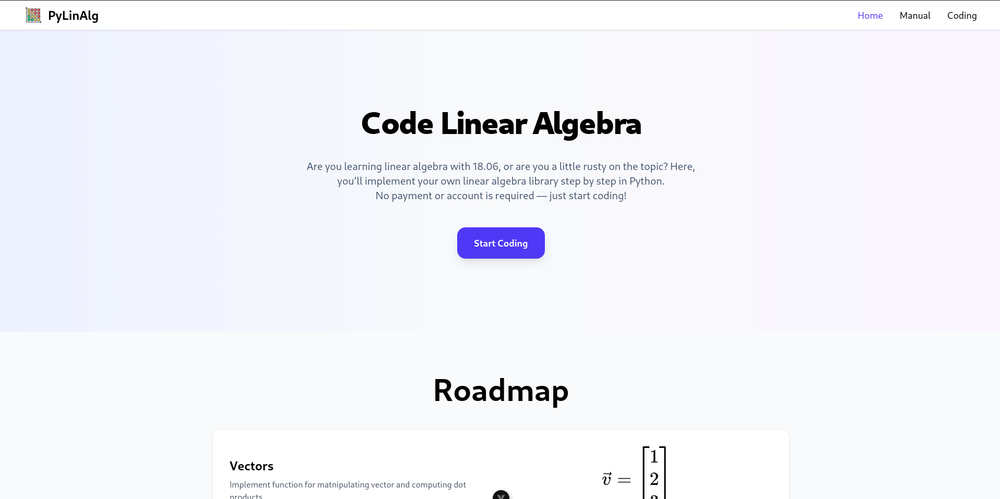

  
  
  
  
  

 

  

  <h3 align="center">LinAlg</h3>

  

    An awesome website to learn linear algebra
     
    <a href="https://pylinalg.com">View Website</a>
    ·
    <a href="https://github.com/adkoprek/LinAlg/issues/new?labels=bug&template=bug-report---.md">Report Bug</a>
    ·
    <a href="https://github.com/adkoprek/LinAlg/issues/new?labels=enhancement&template=feature-request---.md">Request Feature</a>
  

<!-- ABOUT THE PROJECT -->
## About The Project

  

This project consists of a python Linear Algebra library written in python which is not efficient nor numerically stable but is though as a way of learning the mathematical concepts. The second part is a website that allows you to programm your own library.

### Built With

[![HTML][HTML.js]][HTML-url]
[![CSS][CSS.js]][CSS-url]
[![JavaScript][JavaScript.js]][JavaScript-url]
[![Python][py.js]][py-url]

## Usage

You can open this website over this [link](#)

## Contributing

Contributions are what make the open source community such an amazing place to learn, inspire, and create. Any contributions you make are **greatly appreciated**.

If you have a suggestion that would make this better, please fork the repo and create a pull request. You can also simply open an issue with the tag "enhancement".
Don't forget to give the project a star! Thanks again!

1. Fork the Project
2. Create your Feature Branch (`git checkout -b feature/AmazingFeature`)
3. Commit your Changes (`git commit -m 'Add some AmazingFeature'`)
4. Push to the Branch (`git push origin feature/AmazingFeature`)
5. Open a Pull Request

## License

### Third-party Licenses

This project uses the following third-party packages:

- caniuse-lite@1.0.30001743 (CC-BY-4.0) — [https://github.com/Fyrd/caniuse](https://github.com/Fyrd/caniuse)
- type-fest@4.41.0 (CC-BY-4.0) — [https://github.com/sindresorhus/type-fest](https://github.com/sindresorhus/type-fest)

Distributed under the MIT License. See `LICENSE.txt` for more information.

[HTML.js]: https://img.shields.io/badge/HTML5-E34F26?style=for-the-badge&logo=html5&logoColor=white
[HTML-url]: https://html.com
[CSS.js]: https://img.shields.io/badge/CSS3-1572B6?style=for-the-badge&logo=css3&logoColor=white
[CSS-url]: https://css.com
[JavaScript.js]: https://img.shields.io/badge/JavaScript-323330?style=for-the-badge&logo=javascript&logoColor=F7DF1E
[JavaScript-url]: https://en.wikipedia.org/wiki/CSS
[py.js]: https://img.shields.io/badge/Python-FFD43B?style=for-the-badge&logo=python&logoColor=blue
[py-url]: https://python.org
